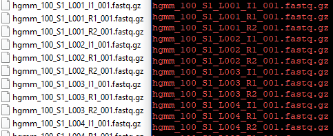

# FASTR
## Introduction
FASTR (**F**astq **A**lignment-based **S**or**T**ing of sc**R**NA seq reads) is a preprocessing tool designed to convert scRNA seq results into a format compatible with analysis tools designed for general high-throughput sequencing data such as DNA seq. The main advantage of scRNA seq is that it allows researchers to sequence individual cells, whereas more traditional techniques sequence the aggregate genetic material from a population of cells. However, this means that scRNA seq results contain a mix of reads from perhaps thousands of diffrent cells. FASTR seperates sequecing reads from scRNAseq by their cell of origin and performs a preliminary filter using bowtie2 alignment, producing high-quality inputs that is compatible with existing custom analysis tools.
## Getting started
### Installation
FASTR is written in python can be installed from its [GitHub page](https://github.com/zzhu33/test/blob/master/FASTR.zip). 
#### System requirements
FASTR requires a linux x86-64 operating system (tested on RHEL 6, kernel 3.10.0-693).

Hardware requirements are dependent on CPU and input size:
  - free drive space: 30x the size of compressed input fastqs, or 3x the size of uncompressed fastqs.
  - CPU: no minimum requirement, but >16 core system with single core performance comparable or better than Intel e5-2680 is   recommended.
  - memory: >500 MB per logical processor, 1 GB per logical processor recommended.
### Dependencies
[bowtie2 2.3.2](http://bowtie-bio.sourceforge.net/bowtie2/index.shtml) or later

python 3.6.4 or 3.7.4
  
**python packages**

numpy, pandas


It is recommended to dowload and extract the [human GRCh38](ftp://ftp.ncbi.nlm.nih.gov/genomes/archive/old_genbank/Eukaryotes/vertebrates_mammals/Homo_sapiens/GRCh38/seqs_for_alignment_pipelines/GCA_000001405.15_GRCh38_no_alt_analysis_set.fna.bowtie_index.tar.gz) Bowtie2 reference index to `FASTR/bowtie2_index/GRCh38`. This is the default reference index for alignment. Users can also specify any reference index explicitly with `--ind` using Bowtie2 syntax. Ex: `--ind /home/bowtie_inds/GCA_000001405.15_GRCh38_no_alt_analysis_set.fna.bowtie_index`. Alternatively, users can also edit `bowtie2indexdir` and `bowtie2indexname` to change FASTR's default index.

## Tutorial
This tutorial will guide the user in processing a sample scRNA seq result from 10x Genomic. 
### Inputs
The example inputs are [sample fastqs](http://cf.10xgenomics.com/samples/cell-exp/1.2.0/hgmm_100/hgmm_100_fastqs.tar) from 10x Genomics. The tarball needs to be extracted, although the individual files can be left as .fastq.gz files, or extracted fully as .fastq files. These files should appears similar to those shown in Fig.1.

**Fig.1:** Input fastq files.



Note that the input filenames need to follow the folowing convention: 
```
<sample_name>_S1_L00<lane_number>_<read_type>_001.fastq.gz`
```
where `<read_type>` is R1, R2, or I1.

The example reference index is the [human GRCh38](ftp://ftp.ncbi.nlm.nih.gov/genomes/archive/old_genbank/Eukaryotes/vertebrates_mammals/Homo_sapiens/GRCh38/seqs_for_alignment_pipelines/GCA_000001405.15_GRCh38_no_alt_analysis_set.fna.bowtie_index.tar.gz) index provided by [Bowtie2](http://bowtie-bio.sourceforge.net/bowtie2/index.shtml). Please refer to the Bowtie2 [manual](http://bowtie-bio.sourceforge.net/bowtie2/manual.shtml) for its installation instructions, if needed. This is the default Bowtie2 reference index and should be placed in `FASTR/bowtie2_index/GRCh38`, as shown in the installation instructions. 
### Running FASTR
Usage:
```
python3 FASTR.py [options]* --n <input_name> --i <input_directory> --r <output_directory> --ind <bowtie2_index>
```
notes: 
  - syntax is not strictly enforced and inputs can be in any order that is suitable to the user.
  - the syntax for `--ind <bowtie2_index>` needs to match the Bowtie2 `-x` command; `<bowtie2_index>` is not the full filename of the bowtie index
    - incorrect: `--ind /home/bowtie2_inds/example/example_index.1.bt2`
    - correct: `--ind /home/bowtie2_inds/example/example_index`

**Example run:**

command:
```
$home/<name> python3 FASTR.py --cc 1000 --sc 100000 --n hgmm_100_S1_L001_I1_001.fastq --i /home/FASTR_testing/fastqs --r /home/FASTR_testing/test_run 
```

If the Bowtie2 index was not placed in the default location, add `--ind <path>/GCA_000001405.15_GRCh38_no_alt_analysis_set.fna.bowtie_index` to the run command. User can also edit the `bowtie2indexdir` option in `config.ini`.
### Results
Results will be written to `/home/FASTR_testing/test_run` along with intermediate files and summary log. However, all intermediate files except sorted sams will be deleted. If the output directory does not exist, it will be automatically created.  The results will be in `/home/FASTR_testing/test_run/results`. By default, the results are compressed fastq files. There will be directories corresponding to each sample index that met the sample index read cuttoff, and numerous fastqs inside each directory, one for each cell barcode that met the specified cuttoff (Fig.2). A log ,`summary.txt`, is also provided, which includes run parameters and run times, as well as other information about the run. 

**Fig.2** Output fastq files


Note that there are four directories in the output (Fig.2, left), each with a different sample index and contains close to 100 cells (Fig.2, right). However, the [summary](http://cf.10xgenomics.com/samples/cell-exp/1.2.0/hgmm_100/hgmm_100_web_summary.html) provided by 10x Genomics indicates that there should be only ~100 valid cells present in the data.

A closer examination of the results would reveal that results from each sample appear to have nearly identical sets of cell barcodes. In this case, it can be useful to use the `--ig` option to check if the different sample indeces are truly what they seem:
```
$home/<name> python3 FASTR.py --ig True --cc 1000 --sc 100000 --n hgmm_100_S1_L001_I1_001.fastq --i /home/FASTR_testing/fastqs --r /home/FASTR_testing/test_run_pooled
```
The new outputs consists of 109 cells. Running FASTR with `--ig True` assumes that all reads are from the same sample and ignores any sample index. The summary log indicates that 88.52% of aligned reads were selected. This means that reads with the same cell and UMI barcodes but diferrent sample indeces aligned to the same positions. In this case, it appears safe to pool reads from different sample indeces. Conversely, if ~20% of aligned reads were selected, then it would be counterproductive to pool the reads.

It may seem odd that only 61.51% of reads are aligned to the reference. However, this sample data is a mix of mouse and human cells, and this tutorial only aligned to a human reference genome. When using the mouse mm10 reference index, 44.17% of reads successfully align. Note that there is overlap due to substantial similarities between the mouse and human genomes. FASTR currently only aligns to one genome for each run. FASTR still identified ~100 cells instead of ~50 due to genomes similarities, although fewer reads are expected in cells of mouse origin. The converse is true when aligning using the mouse mm10 reference index.


